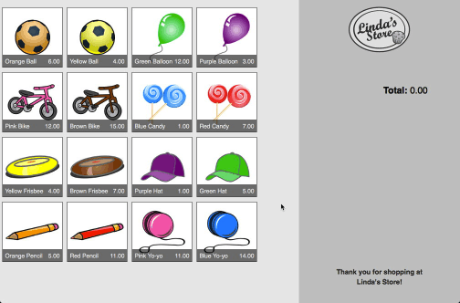

# Shopping Cart

> A Vue-based shopping cart for ESL learners.



Based on a [very old drag&drop Tutsplus tutorial][tutsplus].

ESL learners can practice buying and selling. Use your favorite sentence structures and images. **Works great on interactive whiteboards.**

## How to use

After adding images and building the app, open `index.html`. Images can be dragged into the cart/receipt (on the right). Maximum 10 items in the cart.

Remove item from cart by double-clicking the item. (doesn't work on touch screens yet)

## Ideas
 * Restaurant: "I'd like some spaghetti, please."
 * Toy store: "Can I have a dinosaur, please?"
 * Green Grocers
 * Clothing store: "Do you have this in blue?"

## Not yet implimented

In an older version of this shopping cart, items could have a random colour. The logic is in this version, but not easily implimented (You need transparent images so a background colour can show through). It's a work in progress.

## Build Setup

``` bash
# install dependencies
npm install

# Add some images to the `images` folder. (sample images from placehold.it)
# each image should be its name with hyphens.
# ie. `my-supar-sellable-thing.jpg`
npm run imgjson

# Change `src/assets/logo.png` file to your store logo.

# serve with hot reload at localhost:8080
npm run dev

# build for production with minification
npm run build
```

[tutsplus]: https://code.tutsplus.com/tutorials/implementing-html5-drag-and-drop--net-10824
